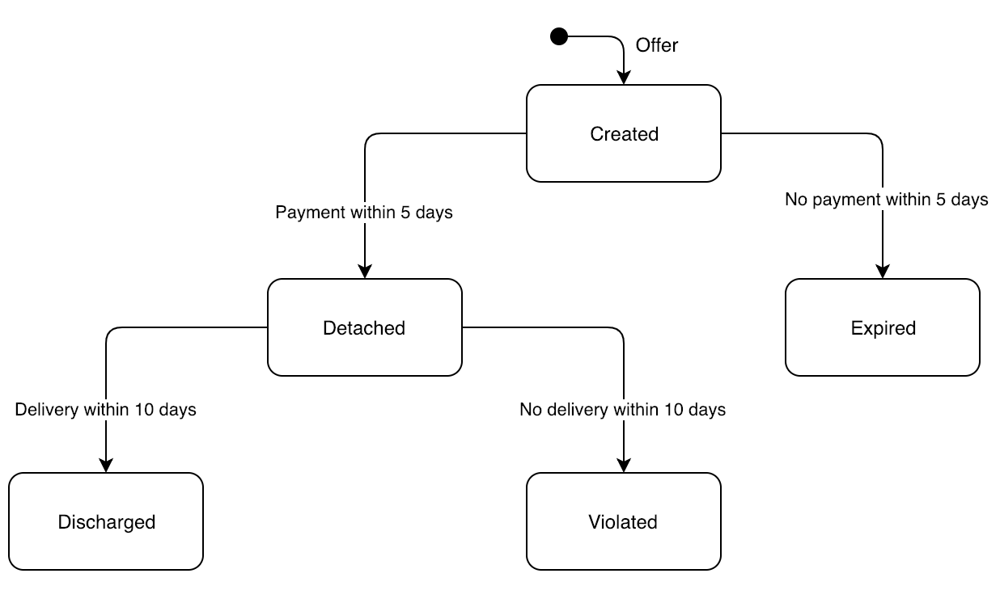

# Quark
This repository contains the source code for the quark contract language.

## Introduction

Quark is a simple, declarative programming language allowing developers to easily define contracts.

Quark uses specifications to define conditions in contracts.

For example, an offer can be created whereby an item is offered by you to another person. 
You can define the price, the quality and any other parameters, such as the deadline before which a payment should be made.
Payment and delivery criteria can also be defined.

## Methodology

A commitment refers to an instance of a specification. 

<p align="center">
  
</p>

## Syntax

A contract specification can be defined as follows;

```
spec SPEC_NAME DEBTOR to CREDITOR
  create EVENT [ARG_LIST]
  detach EVENT [ARG_LIST, deadline=X]
  discharge EVENT [ARG_LIST, deadline=Y]
```

```
| --------- | -------------------------------------------------- | ------------------------------------------ |
| Element   | Description                                        | Examples                                   |
| --------- | -------------------------------------------------- | ------------------------------------------ |
| SPEC_NAME | The name of the specification.                     | SellItem, Refund                           |
| --------- | -------------------------------------------------- | ------------------------------------------ |
| DEBTOR    | The ID/name of the person in debt to the creditor. | dID, debtorName                            |
| --------- | -------------------------------------------------- | ------------------------------------------ |
| EVENT     | The name of the event (akin to relations in SQL).  | Offer, Pay, Delivery                       |
| --------- | -------------------------------------------------- | ------------------------------------------ |
| ARG_LIST  | The list of arguments associated with the event.   | [item,price],                              |
|           |                                                    | [address,shippingtype,deadline]            |
| --------- | -------------------------------------------------- | ------------------------------------------ |
| deadline  | The date by which this event should occur.         | detach EVENT [ARG_LIST, deadline=10]       |
|           | (i.e. no. of days (as an integer) after the        | (i.e. event will be detached if this event |
|           | previous event occured = deadline date).           | occurs within CREATE_EVENT_DATE+10 days,   |
|           |                                                    | otherwise the commitment expires)          |
| --------- | -------------------------------------------------- | ------------------------------------------ |
```

> **Note:** Every contract specification **MUST** include a deadline value in the detach and discharge event argument lists.

An example 'SellItem' specification is defined below:
```
spec SellItem dID to cID
  create Offer [item,price,quality]
  detach Pay [amount,address,shippingtype,deadline=5]
  discharge Delivery [deadline=5]
```


